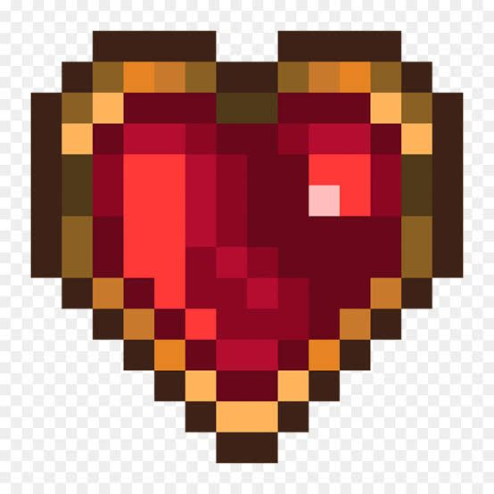
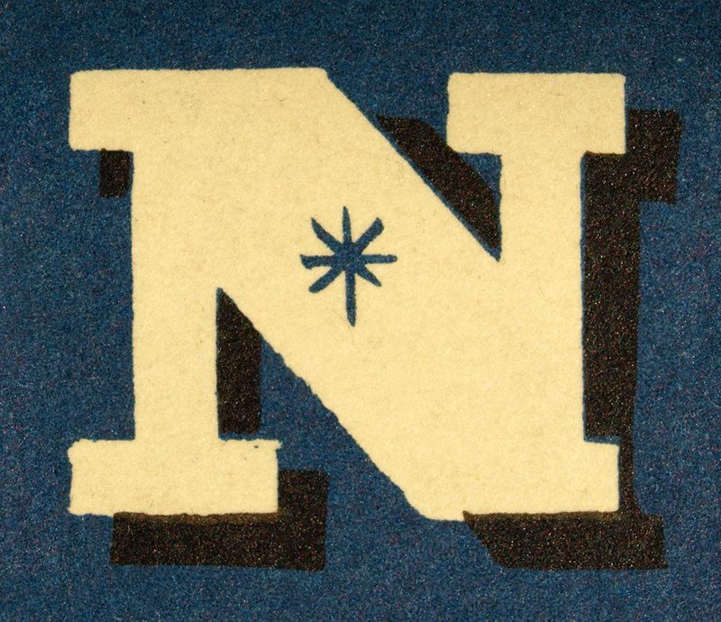
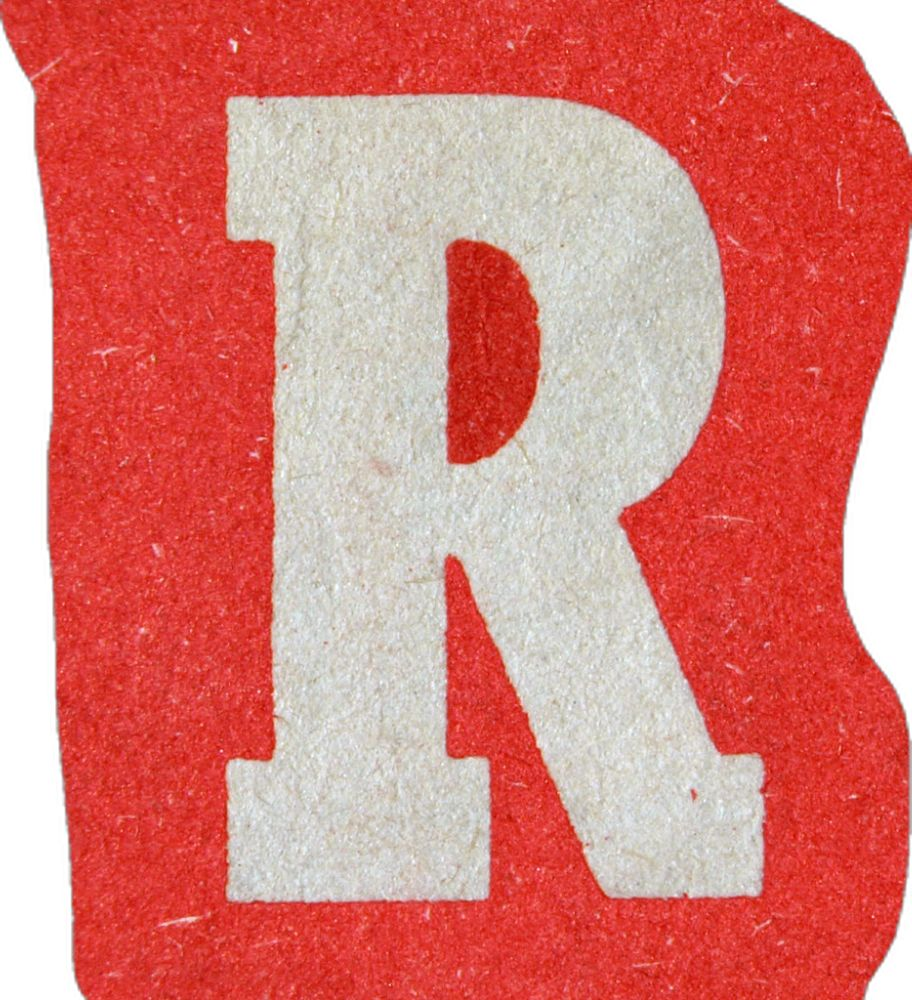
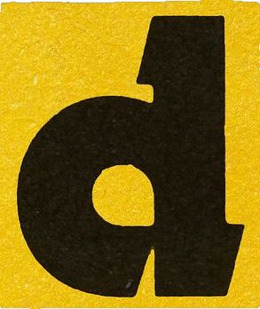

<h2>🤍</h2>

  ✵

### \Worked

  
  
  
  
  
  
  
  
  
  ✵

### \Socials

✵

<!--**nordjkpl2/nordjkpl2** is a ✨ _special_ ✨ repository because its `README.md` (this file) appears on your GitHub profile.
Here are some ideas to get you started:
- 🔭 I’m currently working on ...
- 🌱 I’m currently learning ...
- 👯 I’m looking to collaborate on ...
- 🤔 I’m looking for help with ...
- 💬 Ask me about ...
- 📫 How to reach me: ...
- ⚡ Fun fact: ...-->
